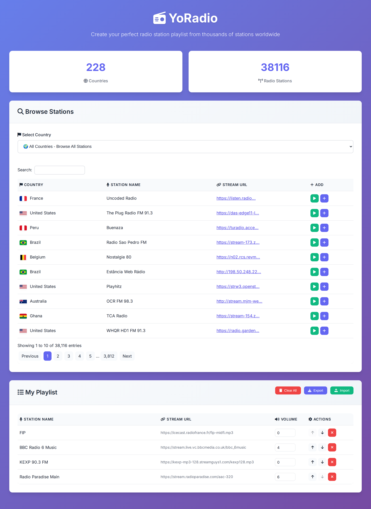
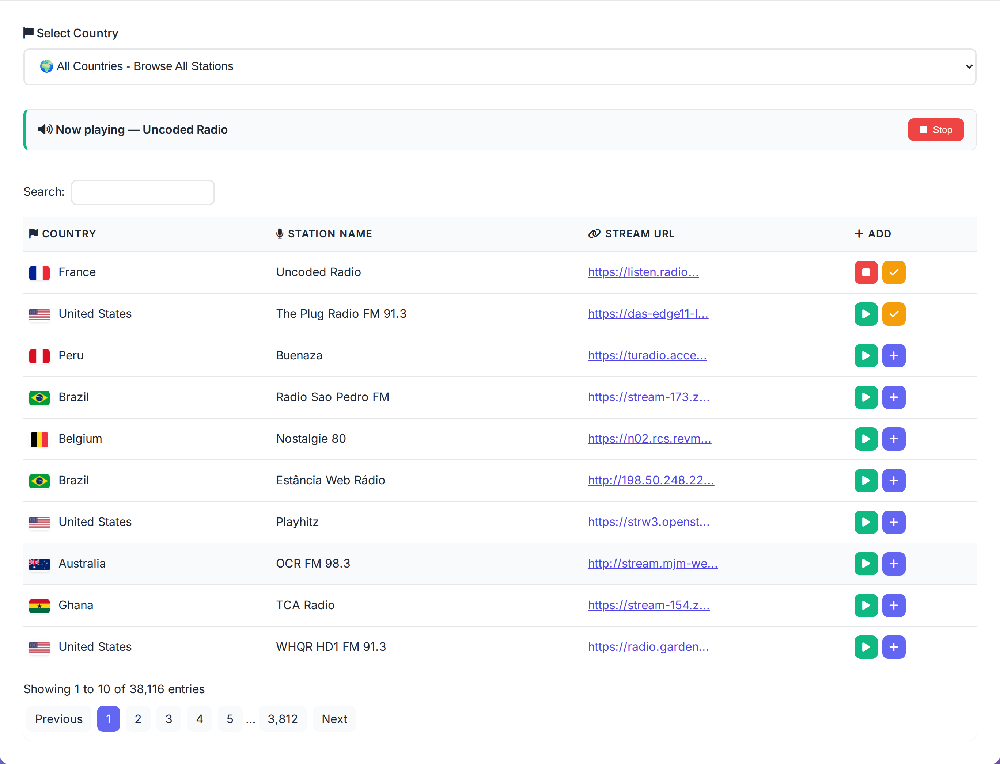
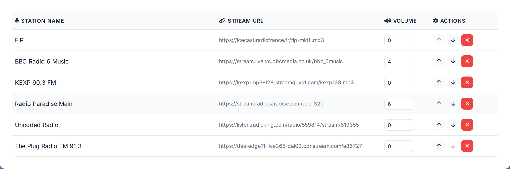
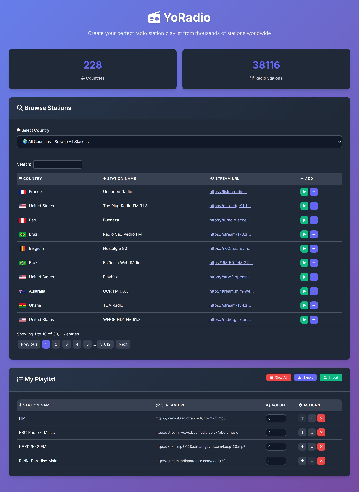
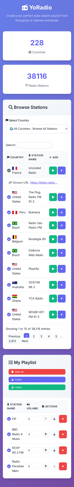

# yoradio-station-list-builder

Browse a database of ~38,000 internet radio stations, build a playlist in the
browser, and export it as a tab-separated list for
[YoRadio](https://github.com/e2002/yoradio).

Runs on Cloudflare Workers: a single Worker serves the UI as static assets and
the JSON API from a [D1](https://developers.cloudflare.com/d1/) database.

## The app

Pick a country or search across all 38,116 stations, preview a stream in the
browser, and add the ones you want. The playlist is built client-side and kept
in `localStorage`, so it survives a reload.



### Browsing and previewing

Play any station in place: the button becomes a stop control, and a banner
tracks what is playing while you carry on browsing. A stream that cannot be
reached says so instead of failing silently. Stations already in your playlist
are marked, so you can see at a glance what you have picked.



### Building the playlist

Position in the list is position on the device, so entries are moved up and
down rather than sorted. Each station's volume offset is edited inline, and the
list exports to the tab-separated file YoRadio reads.



### Dark mode

The theme follows the operating system preference.



### Small screens

Below the mobile breakpoint the tables keep the columns that matter — station
name and the controls — and collapse the rest into a row you can expand.



## Layout

| Path | What it is |
|---|---|
| `src/` | The Worker — `index.ts` routes, `db.ts` queries, `params.ts` parsing |
| `public/` | Static UI served by the assets binding |
| `test/` | Vitest suite, run inside workerd against a real local D1 |
| `migrations/` | D1 migrations — schema and station data. **Committed** |
| `scripts/build-migrations.py` | Regenerates `migrations/` from the SQLite database |
| `legacy/` | The original FastAPI app. **Unmaintained**, kept for reference |
| `legacy/db/stations.db` | Source of truth for the station data |
| `assets/screenshots/` | README images |

## First-time setup

```sh
npm install

# Create the database, then copy the printed database_id into wrangler.jsonc
npx wrangler d1 create yoradio-stations
```

That is the only manual step. The schema and all ~38,000 stations ship as D1
migrations in `migrations/`, applied automatically on deploy.

## Develop

```sh
npm run dev        # local Worker at http://localhost:8787
npm test           # vitest inside workerd
npm run typecheck
```

For local data, apply the migrations to the local database once:

```sh
npm run migrations:apply:local
```

## Deploy

Deploying applies any unapplied migrations first, then uploads the Worker:

```sh
npm run deploy      # wrangler d1 migrations apply DB --remote && wrangler deploy
```

Migrations record themselves in a `d1_migrations` table, so this is a no-op on
every deploy after the first — the data loads once and repeat deploys skip it.

### Via the Cloudflare dashboard (Workers Builds)

Connect the repository under **Workers → your Worker → Settings → Build**, then:

| Field | Value |
|---|---|
| Build command | `npm ci` |
| Deploy command | `npm run deploy` |
| API token | A token with **D1 edit** permission (see below) |

**The API token matters.** The token Cloudflare generates for Workers Builds by
default covers Workers Scripts, KV and R2 — but *not* D1, so `migrations apply`
will fail with the default. Create a token with D1 edit permission and select it
in the API token field.

The build image is Ubuntu with Node preinstalled but **no `sqlite3` binary**,
which is why `migrations/` is committed rather than generated at build time.

### Via GitHub Actions

The **Deploy to Cloudflare** workflow (`workflow_dispatch`) typechecks and tests
before deploying. It needs two repository secrets:

| Secret | Purpose |
|---|---|
| `CLOUDFLARE_API_TOKEN` | Token with Workers Scripts **and D1** edit permissions |
| `CLOUDFLARE_ACCOUNT_ID` | Your Cloudflare account id |

## API

All endpoints are read-only and CORS-open.

| Method | Path | Notes |
|---|---|---|
| GET | `/api/stations` | `limit` (default 500, max 5000), `offset` |
| GET | `/api/stations/datatable` | `draw`, `start`, `length`, `search`, `country_id` |
| GET | `/api/stations/{country_id}` | |
| GET | `/api/countries` | Ordered by name |
| GET | `/api/countries/{id}` | |
| GET | `/api/count/countries` | `{"status":"ok","count":N}` |
| GET | `/api/count/stations` | `{"status":"ok","count":N}` |
| GET | `/api/search/station?name=` | Substring match on title |

### Differences from the legacy Python API

- **`/api/stations` is capped.** It previously returned all ~38,000 rows. D1
  bills rows read against a 5,000,000/day free-tier quota, so an uncapped
  endpoint let ~130 requests exhaust a day's budget. Pass `limit`/`offset`, or
  use `/api/stations/datatable` for paging.
- **`/metrics` is gone.** Prometheus scraping assumes one instance to scrape;
  a Worker runs at every edge location. Use Workers Analytics instead.

## Playlist format

Tab-separated, one newline-terminated record per station —
`title\turl\tOvol\n` — exported as `playlist.csv`.

- **Order is meaningful.** A station's position in the file is its position on
  the device, which is why the playlist is reordered by hand and never sorted.
- **`Ovol`** is the per-station volume offset. It defaults to `0` and is edited
  inline in the playlist table.
- **Import** reads the same format. A row needs a title and an `http(s)` URL to
  be accepted; blank lines, malformed rows, and stations already in the list are
  counted and reported rather than quietly added. CRLF files are handled.

The playlist lives entirely in the browser, saved to `localStorage` — nothing is
stored server-side.

## Updating the station list

Edit `legacy/db/stations.db`, then regenerate and commit:

```sh
npm run migrations:build
```

This rewrites `migrations/0002_seed_stations.sql` in place. Because that file
is already recorded in `d1_migrations`, an existing database will **not** pick
up the changes — add a new numbered migration for incremental updates instead.

## Cost notes

The two indexes created in `migrations/0001_create_schema.sql` are
load-bearing, not tuning. D1 bills rows read, and without an index on `Stations(country_id)` a
country-filtered page view scans all 38,116 rows — roughly 131 page views would
exhaust the daily free-tier quota. With it, a page view reads about a page's
worth of rows.

## Legacy app

`legacy/` holds the original FastAPI application. It is kept for reference and
receives no updates; it will drift from the Worker. To run it:

```sh
cd legacy
pip install fastapi uvicorn loguru requests ujson starlette-exporter
python app.py          # http://0.0.0.0:8082
```
