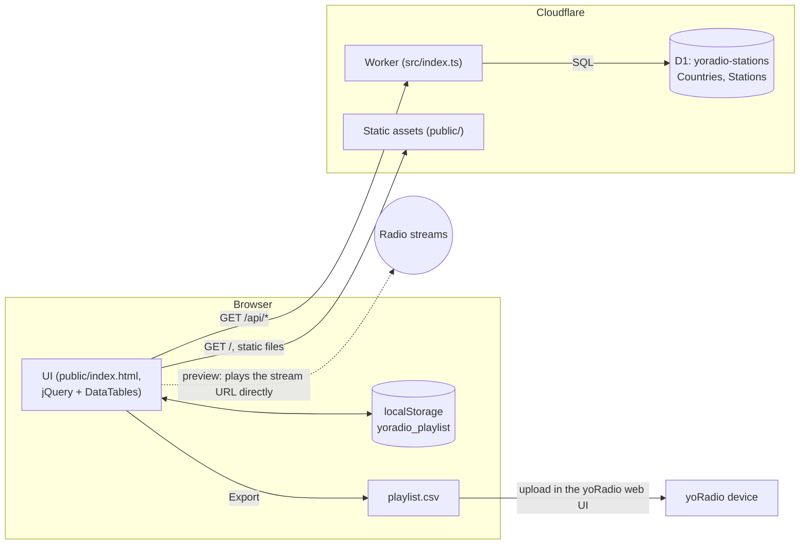

# yoradio-station-list-builder

Browse a database of 38,116 internet radio stations from 228 countries, build a
playlist in the browser, and export it as the tab-separated `playlist.csv` that
[yoRadio](https://github.com/e2002/yoradio), the ESP32 web radio, reads.

It runs on Cloudflare Workers. A single Worker serves the UI as static assets
and a read-only JSON API from a [D1](https://developers.cloudflare.com/d1/)
database. The hosted instance is at **<https://yoradio.licar.biz/>**. It is free
and needs no account.

## Contents

- [Features](#features)
- [The app](#the-app)
- [How it works](#how-it-works)
- [Using the playlist on yoRadio](#using-the-playlist-on-yoradio)
- [Playlist format](#playlist-format)
- [Requirements](#requirements)
- [Layout](#layout)
- [First-time setup](#first-time-setup)
- [Develop](#develop)
- [Deploy](#deploy)
- [API](#api)
- [Updating the station list](#updating-the-station-list)
- [Cost notes](#cost-notes)
- [Troubleshooting](#troubleshooting)
- [Security and privacy](#security-and-privacy)
- [Legacy app](#legacy-app)
- [Contributing](#contributing)
- [Credits](#credits)
- [License](#license)

## Features

- **38,116 stations, 228 countries.** Filter by country, search by station
  name, or page through everything. Paging and search run on the server.
- **Preview in the browser.** Play any stream before adding it. A "Now playing"
  banner has a Stop button, and a stream that can't be played shows an error
  message.
- **Ordered playlist.** Stations are moved up and down rather than sorted,
  because the position in the file is the position on the device.
- **Per-station volume offset** (`Ovol`), edited inline.
- **Export** to `playlist.csv` and **import** an existing playlist. Import
  checks each row and reports how many were added, were already in the list,
  or were skipped.
- **Nothing stored server-side.** The playlist lives in your browser's
  `localStorage` and survives a reload.
- Country flags, dark mode that follows the OS setting, and a responsive
  layout for phones.

## The app

Pick a country or search across all 38,116 stations, preview a stream in the
browser, and add the ones you want. The playlist is built client-side and kept
in `localStorage`, so it survives a reload.


### Browsing and previewing

Play any station in place: the button becomes a stop control, and a banner
tracks what is playing while you carry on browsing. A stream that cannot be
reached says so instead of failing silently. Stations already in your playlist
are marked, so you can see at a glance what you have picked.


### Building the playlist

Position in the list is position on the device, so entries are moved up and
down rather than sorted. Each station's volume offset is edited inline, and the
list exports to the tab-separated file yoRadio reads.


### Dark mode

The theme follows the operating system preference.


### Small screens

Below the mobile breakpoint the tables keep the columns that matter (station
name and the controls) and collapse the rest into a row you can expand.


## How it works



- `wrangler.jsonc` sets `run_worker_first: ["/api/*"]`, so only `/api/*`
  requests run the Worker first. They are handled by `src/index.ts`. `GET /`
  and the other static files are served by Cloudflare's assets layer without
  invoking the Worker.
- The D1 database has two tables, `Countries (id, name)` and
  `Stations (id, title, final_url, country_id)`, plus indexes on
  `Stations(country_id)` and `Stations(title)`.
- The station browser uses DataTables in server-side mode against
  `/api/stations/datatable`. The playlist, preview player, import and export
  all run in the browser.

## Using the playlist on yoRadio

1. Open the app, pick stations, put them in the order you want, and set any
   volume offsets.
2. Click **Export**. The browser downloads `playlist.csv`.
3. Load it onto the device. yoRadio keeps its playlist at
   `/data/playlist.csv` on the device (in the sketch source:
   `yoRadio/data/data/playlist.csv`). You can download the current one from
   `http://<yoradio-ip>/data/playlist.csv`. Either import the file through the
   playlist editor in yoRadio's web interface, or place it in
   `yoRadio/data/data/` before uploading the sketch data. See the
   [yoRadio README and wiki](https://github.com/e2002/yoradio) for the steps
   for your firmware version. <!-- TODO: verify the exact import control in current yoRadio firmware -->
4. To edit an existing device playlist, download it from the device, **Import**
   it here, change it, and export again.

## Playlist format

Tab-separated, one newline-terminated record per station
(`title\turl\tOvol\n`), exported as `playlist.csv`. This matches how yoRadio
parses its playlist: name, then URL, then an integer volume offset.

- **Order is meaningful.** A station's position in the file is its position on
  the device, which is why the playlist is reordered by hand and never sorted.
- **`Ovol`** is the per-station volume offset. It defaults to `0` and is edited
  inline in the playlist table. The builder accepts whole numbers of `0` or
  more.
- **Import** reads the same format (`.csv`, `.tsv` or `.txt`). A row needs a
  title and an `http(s)` URL to be accepted. Blank lines are ignored.
  Malformed rows and stations already in the list (same title and URL) are
  counted and reported rather than quietly added. Double quotes are stripped
  from titles, a negative or non-numeric `Ovol` becomes `0`, and CRLF files are
  handled.

The playlist lives entirely in the browser, saved to `localStorage` under the
key `yoradio_playlist`. Nothing is stored server-side. Clearing site data
clears the playlist, so export anything you want to keep.

## Requirements

- **To use it:** a modern browser and a yoRadio device.
- **To self-host:** a Cloudflare account with Workers and D1 (the free tier is
  enough for light use; see [Cost notes](#cost-notes)).
- **To develop:** Node.js 20 (the version CI uses) and npm. `wrangler`,
  `vitest` and TypeScript are dev dependencies, so there is nothing to install
  globally.
- **To rebuild the station data:** Python 3 (standard library only).

## Layout

| Path | What it is |
|---|---|
| `src/` | The Worker: `index.ts` routes, `db.ts` queries, `params.ts` parsing |
| `public/` | Static UI served by the assets binding (`index.html`, `dist/js/main.js`, vendored jQuery/DataTables, flags, icons, `robots.txt`, `sitemap.xml`) |
| `test/` | Vitest suite, run inside workerd against a real local D1 |
| `migrations/` | D1 migrations: schema and station data. **Committed** |
| `scripts/build-migrations.py` | Regenerates `migrations/` from the SQLite database |
| `legacy/` | The original FastAPI app. **Unmaintained**, kept for reference |
| `legacy/db/stations.db` | Source of truth for the station data |
| `.github/workflows/deploy-cloudflare.yml` | Manual deploy workflow |
| `assets/screenshots/` | README images |

## First-time setup

```sh
npm install        # also runs `wrangler types` (postinstall)

# Authenticate: opens a browser. In CI, set CLOUDFLARE_API_TOKEN instead.
npx wrangler login

# Create the database, then copy the printed database_id into wrangler.jsonc
npx wrangler d1 create yoradio-stations
```

`wrangler.jsonc` in this repository contains the author's `database_id`
(`xxxxxxxx-xxxx-xxxx-xxxx-xxxxxxxxxxxx`). When you deploy your own copy,
replace it with yours. Scripts and the workflow address the database by its
binding name, `DB`, so the database name itself doesn't matter.

That is the only database step. The schema and all 38,116 stations ship as D1
migrations in `migrations/`, applied automatically on deploy.

If you host your own copy, also change the hard-coded site details in
`public/`: the canonical URL, Open Graph and Twitter tags, the JSON-LD
structured data and the Google Analytics tag in `index.html`, and the URLs in
`robots.txt` and `sitemap.xml`. They all
point at `yoradio.licar.biz`.

The custom domain is not defined in `wrangler.jsonc` (there are no `routes`),
so attach one under **Workers → your Worker → Settings → Domains & Routes** if
you want one.

## Develop

```sh
npm run dev        # local Worker at http://localhost:8787
npm test           # vitest inside workerd
npm run typecheck
```

For local data, apply the migrations to the local database once:

```sh
npm run migrations:apply:local
```

### npm scripts

| Script | What it runs |
|---|---|
| `dev` | `wrangler dev` |
| `deploy` | `migrations:apply`, then `wrangler deploy` |
| `migrations:apply` | `wrangler d1 migrations apply DB --remote` |
| `migrations:apply:local` | `wrangler d1 migrations apply DB --local` |
| `migrations:list` | `wrangler d1 migrations list DB --remote` |
| `migrations:build` | `python3 scripts/build-migrations.py` |
| `test` / `test:watch` | `vitest run` / `vitest` |
| `typecheck` | `tsc --noEmit` |
| `types` | `wrangler types` (writes the gitignored `worker-configuration.d.ts`) |

### Tests

The suite (`test/*.test.ts`) runs in workerd through
`@cloudflare/vitest-pool-workers`, using the bindings in `wrangler.jsonc` and a
local D1. `test/fixture.ts` creates the schema and seeds a few countries and
stations of its own, so the tests don't need the migrations applied. It
covers:

- `api.test.ts`: every endpoint, error responses, CORS and route ordering.
- `params.test.ts`: query-parameter parsing and clamping.
- `assets.test.ts`: the static files, including flags and SEO assets.

## Deploy

Deploying applies any unapplied migrations first, then uploads the Worker:

```sh
npm run deploy      # wrangler d1 migrations apply DB --remote && wrangler deploy
```

Migrations record themselves in a `d1_migrations` table, so this is a no-op on
every deploy after the first. The data loads once and repeat deploys skip it.

### Via the Cloudflare dashboard (Workers Builds)

Connect the repository under **Workers → your Worker → Settings → Build**, then:

| Field | Value |
|---|---|
| Build command | `npm ci` |
| Deploy command | `npm run deploy` |
| API token | A token with **D1 edit** permission (see below) |

**The API token matters.** The token Cloudflare generates for Workers Builds by
default covers Workers Scripts, KV and R2, but *not* D1, so `migrations apply`
will fail with the default. Create a token with D1 edit permission and select it
in the API token field.

The build image is Ubuntu with Node preinstalled but **no `sqlite3` binary**,
which is why `migrations/` is committed rather than generated at build time.

### Via GitHub Actions

The **Deploy to Cloudflare** workflow (`.github/workflows/deploy-cloudflare.yml`)
runs only on manual dispatch. It installs with `npm ci` on Node 20, runs the
typecheck and the tests, applies the D1 migrations, and then deploys with
`cloudflare/wrangler-action`. It needs two repository secrets:

| Secret | Purpose |
|---|---|
| `CLOUDFLARE_API_TOKEN` | Token with Workers Scripts **and D1** edit permissions |
| `CLOUDFLARE_ACCOUNT_ID` | Your Cloudflare account ID |

The project has no GitHub releases or version tags. `main` is what gets
deployed.

## API

All endpoints are read-only, answer `GET` and `HEAD`, and are CORS-open
(`Access-Control-Allow-Origin: *`, with `OPTIONS` preflight answered `204`).
The API is there for the UI. It is reachable on the hosted instance, but it is
not a supported public API and may change.

| Method | Path | Parameters | Returns |
|---|---|---|---|
| GET | `/api/stations` | `limit` (default 500, max 5000), `offset` (default 0) | Array of stations |
| GET | `/api/stations/datatable` | `draw`, `start`, `length` (default 10, max 5000), `search`, `country_id` (`0` = all) | `{draw, recordsTotal, recordsFiltered, data}` |
| GET | `/api/stations/{country_id}` | | Array of that country's stations (not paged) |
| GET | `/api/countries` | | Array of `{name, id}`, ordered by name |
| GET | `/api/countries/{id}` | | Array with the matching `{name, id}`, or `[]` |
| GET | `/api/count/countries` | | `{"status":"ok","count":N}` |
| GET | `/api/count/stations` | | `{"status":"ok","count":N}` |
| GET | `/api/search/station` | `name` (required): substring match on title | Array of stations |

A station looks like this:

```json
{"id": "Bd3vTjux", "title": "Haahil FM", "final_url": "http://184.154.45.106:8503/", "country_id": 185, "country": "Mexico"}
```

Out-of-range `limit` and `length` values are clamped rather than rejected, and
invalid ones fall back to the default. Errors are JSON of the form
`{"status":"error","message":"..."}`:

| Status | When |
|---|---|
| `400` | Non-integer id in the path, or `/api/search/station` without `name` |
| `404` | Unknown `/api/...` path (always JSON, never the HTML page) |
| `405` | Any method other than `GET`, `HEAD` or `OPTIONS` |
| `500` | A database error |

### Differences from the legacy Python API

- **`/api/stations` is capped.** It previously returned all ~38,000 rows. D1
  bills rows read against a 5,000,000/day free-tier quota, so an uncapped
  endpoint let ~130 requests exhaust a day's budget. Pass `limit`/`offset`, or
  use `/api/stations/datatable` for paging.
- **`/metrics` is gone.** Prometheus scraping assumes one instance to scrape;
  a Worker runs at every edge location. Use Workers Analytics instead
  (`observability` is enabled in `wrangler.jsonc`).

## Updating the station list

Edit `legacy/db/stations.db`, then regenerate and commit:

```sh
npm run migrations:build
```

This rewrites `migrations/0001_create_schema.sql` and
`migrations/0002_seed_stations.sql` in place. The script reads the database
read-only and writes multi-row `INSERT OR IGNORE` statements, 200 rows each,
and stops with an error if any statement reaches D1's 100,000-byte limit.

Because `0002_seed_stations.sql` is already recorded in `d1_migrations`, an
existing database will **not** pick up the changes. For incremental updates,
add a new numbered migration (for example `0003_...sql`) by hand. The generator
only writes the two files above. Note that `INSERT OR IGNORE` does not change
rows that already exist, so edits to existing stations need `UPDATE` or
`INSERT OR REPLACE` statements.

The current data is a snapshot taken when the database was first committed
(May 2024). There is no scraper or refresh job in this repository.
<!-- TODO: verify how stations.db was produced -->

## Cost notes

D1 bills rows read against a 5,000,000/day free-tier quota. The index on
`Stations(country_id)` (created in `migrations/0001_create_schema.sql`) keeps
country-filtered pages and their filtered count cheap. It does not make every
query cheap:

- Each `/api/stations/datatable` request runs a batch that includes a full
  `SELECT COUNT(*) FROM Stations` for `recordsTotal`. With no country or search
  filter, the filtered count is a full count too.
- Every page load also calls `/api/count/stations`, another full count.
- Name search uses `LIKE '%term%'`, which cannot use the `Stations(title)`
  index.

A single page view can therefore read tens of thousands of rows. This estimate
comes from the queries; `rows_read` has not been measured on the remote
database.

The other cost guards are in the code: `/api/stations` is capped at 5,000 rows
per request, and `robots.txt` keeps crawlers out of `/api/`.

## Troubleshooting

- **A station won't play in the preview.** The preview plays the stream
  directly in your browser, so anything the browser refuses fails: plain
  `http://` streams on the HTTPS site (mixed content), streams without CORS or
  in an unsupported codec, and stations that are offline. Some stream URLs
  carry time-limited tokens from when the data was collected and have probably
  expired. A stream that fails in the browser may still play on the device.
- **My playlist disappeared.** It is stored only in this browser's
  `localStorage`. Private windows, a different browser, or clearing site data
  start from an empty list. Export regularly.
- **Import says rows were skipped.** Each line needs `title<TAB>url`, and the
  URL must start with `http://` or `https://`. Comma-separated files are not
  accepted.
- **Deploy fails at `migrations apply`.** The API token lacks D1 edit
  permission (see [Deploy](#deploy)), or `database_id` in `wrangler.jsonc`
  still points at a database in another account.
- **`npm run dev` returns errors or empty lists.** Apply the migrations locally
  first: `npm run migrations:apply:local`.
- **`npm run typecheck` can't find `Env`.** Run `npm run types` (normally done
  by `postinstall`) to generate `worker-configuration.d.ts`.

## Security and privacy

- The API is read-only and uses bound SQL parameters. It accepts no writes and
  stores no user data.
- Playlists never leave the browser. The server doesn't see what you pick.
- The UI loads fonts and libraries from third-party CDNs (Google Fonts,
  cdnjs, jsDelivr), and the hosted page includes Google Analytics. Remove or
  replace the analytics tag if you self-host.
- Previewing a station connects your browser directly to that station's
  streaming server.
- Keep the Cloudflare API token in repository or dashboard secrets, and scope
  it to the Workers and D1 permissions it needs.

## Legacy app

`legacy/` holds the original FastAPI application (`app.py`, SQLite via
`sqliteconnector.py`, a Jinja template, and vendored AdminLTE plugins). It is
kept for reference and receives no updates, so it will drift from the Worker.
It serves the same API as the Worker, plus the uncapped `/api/stations` and a
Prometheus `/metrics` endpoint.

Recent Starlette releases changed the `TemplateResponse` signature, so the page
at `/` fails with the latest FastAPI. The API routes still work. Pinning FastAPI
0.115 brings the whole app back:

```sh
cd legacy              # paths to db/, templates/, dist/ and plugins/ are relative
pip install "fastapi==0.115.0" uvicorn jinja2 loguru requests ujson starlette-exporter
python app.py          # http://0.0.0.0:8082
```

The port is fixed at 8082 in `app.py`. To use another one, run
`uvicorn app:app --port <port>` from `legacy/`.

## Contributing

Issues and pull requests are welcome. Before opening a PR:

```sh
npm run typecheck
npm test
```

Keep changes to the station data in `legacy/db/stations.db` plus the
regenerated or new migrations, in the same PR.

## Credits

- [yoRadio](https://github.com/e2002/yoradio) by e2002, the ESP32 web radio
  this tool builds playlists for (GPL-3.0).
- The station directory appears to come from [Radio Garden](https://radio.garden/):
  the station IDs are Radio Garden channel IDs, and many stream URLs point at
  `radio.garden`. Station names and stream URLs belong to their broadcasters
  and to Radio Garden. Check their terms before reusing the data.
  <!-- TODO: verify the data source and its terms of use -->
- [jQuery](https://jquery.com/), [DataTables](https://datatables.net/),
  [SweetAlert2](https://sweetalert2.github.io/) and
  [Font Awesome](https://fontawesome.com/) for the UI.

This is an independent project. It is not affiliated with or endorsed by the
yoRadio project, Radio Garden, or any radio station listed.

## License

Apache License 2.0. See [LICENSE](LICENSE).
